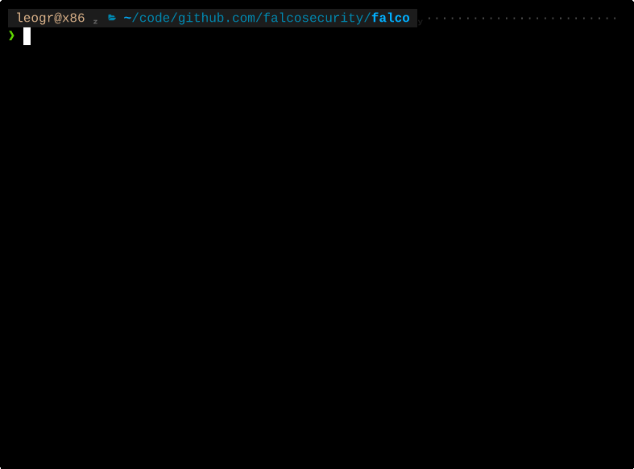

# coding-agents-kit

[](#status)

[](LICENSE)


> **Experimental Preview** — This project is under active development and released as an early preview. Interfaces and behavior may change between releases. We welcome your [feedback](#feedback) to help shape its future.

## Falco meets AI Coding Agents

[](https://asciinema.org/a/lXqokxXVO4Q3IH3W)

**coding-agents-kit** brings [Falco](https://falco.org) to the world of AI coding agents. It is designed for developers who use coding agents daily and want visibility and control over what those agents do on their machines.

True to Falco's tradition, the primary goal is **detection**. The kit provides a **monitor mode** that lets you observe every tool call your coding agent makes — shell commands, file writes, reads, API calls — in real time, evaluated against [Falco rules](https://falco.org/docs/rules/) you define. This gives you a clear picture of what the agent is actually doing during a session.

Unlike classic Falco, this project operates entirely in user space — no kernel modules, no root, no containers. This makes it easy to run on your development machine but comes with [known limitations](#known-limitations): Falco evaluates tool calls as declared by the agent, not the system calls those commands produce.

That said, detecting unwanted behavior is still valuable — even at the tool-call level, it helps you catch the unexpected. The kit also provides a lightweight **enforcement mode** that relies on the coding agent's own hook API to block or prompt for confirmation. Think of it as a way to let Falco instruct the agent to behave as expected and avoid potentially harmful behaviors. This is not a substitute for sandboxing or system hardening — it complements those techniques by adding a policy layer at the agent level.

Ultimately, **coding-agents-kit** is a new way to let Falco and coding agents collaborate, and a foundation for exploring new approaches to protecting your systems against AI-driven threats.

## How It Works

When your coding agent tries to use a tool, **coding-agents-kit** intercepts the call *before* it executes, evaluates it against your security rules, and decides what happens next:

| Verdict | What Happens |
|---------|-------------|
| **Allow** | The tool call proceeds normally |
| **Deny** | The tool call is blocked — the agent is told why |
| **Ask** | You are prompted to approve or reject the call |

Security policies are written as standard [Falco rules](https://falco.org/docs/rules/) in YAML. You get a set of sensible defaults out of the box, and you can add your own rules for your specific needs.

## Quick Start

### macOS

Download the `.pkg` installer from the [latest release](https://github.com/leogr/coding-agents-kit/releases/latest) and open it:

```bash
open coding-agents-kit-0.1.0-darwin-universal.pkg
```

The macOS Installer wizard guides you through the setup. Once complete, the service starts automatically on login.

> [!NOTE]
> Since the binaries are not code-signed, macOS Gatekeeper may block them on first run.
> Go to **System Settings > Privacy & Security** and allow the blocked binary, or run:
> ```bash
> xattr -dr com.apple.quarantine ~/.coding-agents-kit/bin/*
> ```

### Linux

Download the package for your architecture from the [latest release](https://github.com/leogr/coding-agents-kit/releases/latest):

```bash
tar xzf coding-agents-kit-0.1.0-linux-x86_64.tar.gz
cd coding-agents-kit-0.1.0-linux-x86_64
bash install.sh
```

The installer copies all components to `~/.coding-agents-kit/`, starts a systemd user service, and registers the hook automatically.

### Verify

```bash
~/.coding-agents-kit/bin/coding-agents-kit-ctl status
~/.coding-agents-kit/bin/coding-agents-kit-ctl hook status
```

> **Tip:** Add `export PATH="$HOME/.coding-agents-kit/bin:$PATH"` to your shell profile to use `coding-agents-kit-ctl` without the full path.

## Managing

```bash
# Check status
~/.coding-agents-kit/bin/coding-agents-kit-ctl status

# Monitor mode — rules evaluate and log, but verdicts are not enforced
~/.coding-agents-kit/bin/coding-agents-kit-ctl mode monitor

# Enforcement mode (default) — verdicts are enforced
~/.coding-agents-kit/bin/coding-agents-kit-ctl mode enforcement

# View live logs
~/.coding-agents-kit/bin/coding-agents-kit-ctl logs

# Temporarily disable interception (tool calls proceed unmonitored)
~/.coding-agents-kit/bin/coding-agents-kit-ctl hook remove

# Re-enable interception
~/.coding-agents-kit/bin/coding-agents-kit-ctl hook add

# Stop / start the service
~/.coding-agents-kit/bin/coding-agents-kit-ctl stop
~/.coding-agents-kit/bin/coding-agents-kit-ctl start
```

### Uninstall

```bash
~/.coding-agents-kit/bin/coding-agents-kit-ctl uninstall
```

## Default Rules

The project ships with rules that provide baseline protection:

| Rule | Verdict | Description |
|------|---------|-------------|
| Monitor activity outside working directory | — | Logs file access outside the project directory |
| Ask before writing outside working directory | **ask** | Requires your confirmation for writes outside the project |
| Deny writing to sensitive paths | **deny** | Blocks writes to `/etc/`, `~/.ssh/`, `~/.aws/`, `.env`, and other sensitive locations |

## Custom Rules

Add your own rules to `~/.coding-agents-kit/rules/user/`. They are preserved across upgrades.

Example — block piping content to shell interpreters:

```yaml
- rule: Deny pipe to shell
  desc: Block piping content to shell interpreters
  condition: >
    tool.name = "Bash"
    and (tool.input_command contains "| sh"
         or tool.input_command contains "| bash"
         or tool.input_command contains "| zsh")
  output: >
    Falco blocked piping to a shell interpreter (%tool.input_command)
  priority: CRITICAL
  source: coding_agent
  tags: [coding_agent_deny]
```

Rules are written in the standard [Falco rule language](https://falco.org/docs/rules/) (YAML). See [`rules/README.md`](rules/README.md) for all available fields and examples.

### Rule Authoring Skill for Claude Code

A Claude Code [skill](https://github.com/anthropics/skills) is included to help you write custom rules interactively.

Register this repository as a Claude Code Plugin marketplace:

```
/plugin marketplace add leogr/coding-agents-kit
```

Then install the skill directly:

```
/plugin install coding-agents-falco-rules@leogr/coding-agents-kit-skills
```

Or browse and install interactively:

1. Select `Browse and install plugins`
2. Select `leogr/coding-agents-kit-skills`
3. Select `coding-agents-falco-rules`
4. Select `Install now`

Once installed, ask Claude Code things like:
- "Block the agent from running git push"
- "Deny any read outside the working directory"
- "Create a rule that requires confirmation before editing Dockerfiles"

The skill guides Claude through writing the rule, placing it in the right directory, and validating it with Falco.

## Supported Agents & Platforms

| Agent | Platform | Status |
|-------|----------|--------|
| [Claude Code](https://docs.anthropic.com/en/docs/claude-code) | Linux (x86_64, aarch64) | Supported |
| [Claude Code](https://docs.anthropic.com/en/docs/claude-code) | macOS (Apple Silicon, Intel) | Supported |
| [Codex](https://openai.com/index/codex/) | Linux, macOS | Planned |
| — | Windows | Planned |

We are actively working on expanding agent and platform support. [Codex](https://openai.com/index/codex/) integration and Windows support are next on the roadmap.

## Building from Source

<details>
<summary><strong>Linux</strong></summary>

Requires: Rust (latest stable)

```bash
make linux              # Both architectures
make linux-x86_64       # x86_64 only
make linux-aarch64      # aarch64 only (requires cross toolchain)
```

Output: `build/coding-agents-kit-0.1.0-linux-{arch}.tar.gz`

See [`installers/linux/`](installers/linux/) for details.

</details>

<details>
<summary><strong>macOS</strong></summary>

Requires: Rust (latest stable), CMake >= 3.24, Xcode Command Line Tools, OpenSSL via Homebrew

```bash
# Install prerequisites
xcode-select --install
brew install cmake openssl@3
curl --proto '=https' --tlsv1.2 -sSf https://sh.rustup.rs | sh

# Build
make macos-aarch64      # Apple Silicon
make macos-x86_64       # Intel (must build on matching hardware or via Rosetta)
make macos-universal    # Universal binary (requires Rosetta + x86_64 Homebrew)
```

Output: `build/coding-agents-kit-0.1.0-darwin-{arch}.{tar.gz,pkg}`

> Falco does not ship pre-built macOS binaries. The first build compiles Falco from source (~5 min). Subsequent builds use the cached binary.

See [`installers/macos/`](installers/macos/) for details.

</details>

<details>
<summary><strong>Individual Components</strong></summary>

```bash
cd hooks/claude-code && cargo build --release            # Interceptor
cd plugins/coding-agent-plugin && cargo build --release   # Falco plugin
cd tools/coding-agents-kit-ctl && cargo build --release   # CLI tool
make falco-macos                                          # Falco binary (macOS only)
```

</details>

## Architecture

```
┌──────────────┐      ┌──────────────┐      ┌────────────────────────────┐
│ Coding Agent │────▶│ Interceptor  │────▶│     Falco (nodriver)       │
│              │      │   (hook)     │      │  ┌───────────────────────┐ │
│              │◀────│              │◀────│  │  Plugin (src + extract│ │
│              │      │              │      │  │  + embedded broker)   │ │
└──────────────┘      └──────────────┘      │  └───────────────────────┘ │
                                            │  Rule Engine + Rules       │
                                            └────────────────────────────┘
```

1. The coding agent's hook fires before each tool call
2. The **interceptor** sends the event to the plugin's embedded broker via Unix socket
3. The **plugin** feeds the event to Falco's rule engine
4. Matching rules produce verdicts (deny/ask/allow)
5. The **interceptor** delivers the verdict back to the coding agent

For design decisions, component specs, and full architectural documentation, see [CLAUDE.md](CLAUDE.md).

## Known Limitations

### Hook-level interception

**coding-agents-kit** intercepts tool calls at the coding agent's hook API — it sees the commands the agent asks to run, not the side effects those commands produce on the system.

This means that if a coding agent embeds harmful logic in a source file, compiles it, and then runs the resulting binary, Falco can inspect the compile and run commands but cannot analyze what the compiled program actually does at runtime. The rules see `gcc main.c -o main` and `./main`, not the system calls that `./main` makes.

This is inherent to the hook-based approach: Falco evaluates tool calls as declared by the agent, not the actions those tool calls perform at the OS level. For deeper visibility — detecting what processes actually do at the syscall level — Falco's kernel instrumentation (eBPF/kmod) is the right tool (at least for Linux).

## Feedback

Runtime security for AI coding agents is new territory — we're learning alongside the community.

If you're using **coding-agents-kit**, we'd love to hear from you:

- **What works?** What rules have you written? What did you catch?
- **What's missing?** What agents or platforms do you need?
- **What broke?** What didn't work as expected?

Your experience directly shapes where this project goes next. Open an [issue](https://github.com/leogr/coding-agents-kit/issues), start a [discussion](https://github.com/leogr/coding-agents-kit/discussions), or reach out to the maintainers. Every bit of feedback helps.

## Credits

**coding-agents-kit** was built with significant assistance from [Claude Code](https://github.com/anthropics/claude-code).

Initial research and ideation by [Leonardo Grasso](https://github.com/leogr), [Loris Degioanni](https://github.com/ldegio), and [Michael Clark](https://github.com/MikeC-Sysdig).

Support and testing by [Alessandro Cannarella](https://github.com/c2ndev), [Iacopo Rozzo](https://github.com/irozzo-1a), and [Leonardo Di Giovanna](https://github.com/ekoops).

## License

Apache License 2.0. See [LICENSE](LICENSE).
